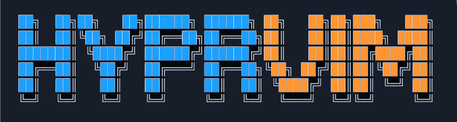

<p align="center">
  
</p>
<hr/>
<p align="center">
  <a href="https://github.com/uhs-robert/hyprvim/stargazers"></a>
  <a href="https://github.com/uhs-robert/hyprvim/issues"></a>
  <a href="https://github.com/uhs-robert/hyprvim/contributors"></a>
  <a href="https://github.com/uhs-robert/hyprvim/network/members"></a>
</p>

## 🌅 Overview

**HyprVim** brings the power of Vim keybindings and motions to your entire Hyprland desktop environment.

Uses Hyprland's submap system to provide vim-style navigation and basic text editing that works across all applications in your Wayland session.

Navigate text, manage selections, and perform text operations using familiar Vim motions without leaving your current application. Think of it as a lightweight, system-wide vim mode for your desktop.

<https://github.com/user-attachments/assets/735c4930-a527-4f3a-9f1a-308a9c047332>

## ✨ Features

### 🚦 Vim Modes

- **NORMAL Mode**: Primary navigation with `hjkl` movement, word motions (`w`/`b`/`e`), and operators
- **INSERT Mode**: Text insertion with `ESCAPE` bound to return to normal mode
- **VISUAL Mode**: Character-wise visual selection
- **V-LINE Mode**: Line-wise visual selection
- **COMMAND Mode**: Execute vim commands (`:w`, `:wq`, `:q`, `:qa`, `:%s`, `:help`)
- **COUNT Modifier**: Perform operations with `{count}` modifier prefix to repeat actions (e.g., `6dw` to delete next 6 words)
- **OPERATOR Modes**: Operators with motions `{operator}` + `{motion}`/`{text-object)` (e.g., `diw` for delete in word)
  - _Operators Supported:_ `d`, `c`, `y`
  - _Motions Supported:_ `i`, `a`
  - _Text Objects Supported:_ `w`, `p`

### 🧭 Navigation & Motion

- **Character**: `hjkl` for basic movement
- **Word**: `w`, `b`, `e`, `W`, `B`, `E` for word-based navigation
- **Line**: `0`, `^`, `$` for line start/end navigation
- **Paragraph**: `{`, `}` for paragraph start/end navigation
- **Page**: `CTRL+d`, `CTRL+u`, `CTRL+f`, `CTRL+b` for page scrolling
- **Document**: `gg`, `G` for document start/end
- **Extended Motions**: `g` prefix for additional movements (`ge`, `gt`, `gT`)

### 📝 Text Objects & Operators

- **Delete**: `d{motion}`, `dd`, `dw`, `diw`, `daw`, `dip`, `dap`
- **Change**: `c{motion}`, `cc`, `cw`, `ciw`, `caw`, `cip`, `cap` (enters insert mode)
- **Yank**: `y{motion}`, `yy`, `yw`, `yiw`, `yaw`, `yip`, `yap`
- **Inner/A**: `iw`/`aw` for word text objects, `ip`/`ap` for paragraph text objects

### 📌 Mark System

- **Set/Jump/Delete**: `m{a-z,A-Z,0-9}`, `` `{mark} ``, `'{mark}`, `dm{mark}`
- Remembers window/workspace locations across monitors

### 📋️ Register System

- **Named**: `"{a-z}` - 26 named registers
- **Special**: `""` (unnamed/clipboard), `"0` (yank), `"_` (black hole), `"/` (search)
- **Usage**: `"ayy` (yank to a), `"ap` (paste from a), `"_dd` (delete without clipboard)

> [!NOTE]
> Registers stored in tmpfs, cleared on reboot. See [Using Registers](#register-usage) for detailed examples.

### 🛟 Additional Operations

- **Help**: `gh` - Show keybindings viewer
- **Command Mode**: `:` - Execute vim commands
  - `:w` - Save file (Ctrl+S)
  - `:wq` - Save and quit window
  - `:q` - Quit window (prompts to save)
  - `:q!` - Force quit window
  - `:qa` - Quit all windows in workspace
  - `:qa!` - Force quit all windows
  - `:%s`, `:s` - Open find/replace dialog
  - `:help`, `:h` - Show help
- **Repeats**: `2dw`, `3j`, `5w` (up to 999)
- **Undo/Redo**: `u`, `Ctrl+r`
- **Find**: `/`, `?`, `f`, `F`, `t`, `T`, `*`, `#`, `n`, `N`
- **Replace**: `r{char}`, `R` (with prompt)
- **Insert**: `i`, `a`, `I`, `A`, `o`, `O`
- **Paste**: `p`, `P`
- **Delete Char**: `x`, `X`
- **Indent**: `>`, `<`

### ✏️ Full Editor Access

For complex editing tasks that require the full power of vim/nvim (multi-line edits, macros, plugins, syntax highlighting), HyprVim includes an **Open Editor** helper script:

- **`$LEADER + N`** - Opens vim/nvim in a floating window
  - Automatically grabs selected text (if any)
  - Edit with full vim features and your personal config
  - On save (`:wq`), pastes content back to focused window
  - Works in all vim modes (NORMAL, VISUAL, LINE, V-LINE, G-submaps)

Examples of how to use this script in your own keybindings can be found in [hyprland-basics](/extras/hyprland-basics/keymap.conf)

> [!TIP]
> Set `$HYPRVIM_EDITOR` in `./settings.conf` to use `vim` or `nvim` (default: `nvim`)

### ‼️ Exiting Vim Mode

Just like real Vim, you also need to know how to exit HyprVim.

- **Return to Normal**: `ESC` - (e.g., VISUAL → NORMAL), NORMAL passes ESC to application
- **Toggle Vim Mode**: `$LEADER + ESC` - Toggle vim mode on/off from anywhere
- **Emergency Exit**: `ALT + ESC` - Immediate return to normal Hyprland bindings

<details>
<summary>🍭 Extras</summary>
<br>

[All extra configs](extras/) for a better global vim experience.

To use the extras, refer to their respective documentation.

<!-- extras:start -->

| Tool            | Description                                                               | Extra                                            |
| --------------- | ------------------------------------------------------------------------- | ------------------------------------------------ |
| Hyprland Basics | Hyprland keymap kickstart config for HyprVim (Resize, Move, Windows, etc) | [extras/hyprland-basics](extras/hyprland-basics) |
| Keyd            | System-wide key remaps and tap/hold layers                                | [extras/keyd](extras/keyd)                       |
| Thunderbird     | Keybinds for vim driven navigation                                        | [extras/thunderbird](extras/thunderbird)         |
| Wl-kbptr        | Keyboard-driven mouse cursor control on Wayland                           | [extras/wl-kbptr](extras/wl-kbptr)               |
| Vimium          | Vim-style navigation for web browsers                                     | [extras/vimium](extras/vimium)                   |
| Waybar Submap   | Waybar submap visual Indicator                                            | [extras/waybar](extras/waybar)                   |

If you'd like an extra config added, raise a feature request and I'll put it together.

<!-- extras:end -->
</details>

## 📦 Installation

### Prerequisites

| Name                                           | Description                                                               |
| ---------------------------------------------- | ------------------------------------------------------------------------- |
| [Hyprland](https://github.com/hyprwm/Hyprland) | Wayland compositor                                                        |
| Bash                                           | For shell scripts                                                         |
| `wl-clipboard`                                 | Wayland clipboard utilities (`wl-copy`, `wl-paste`)                       |
| `jq`                                           | JSON processor for parsing hyprctl output                                 |
| A terminal emulator                            | For the `gh` help viewer                                                  |
| A prompt tool                                  | One of: `rofi`, `wofi`, `tofi`, `fuzzel`, `dmenu`, `zenity`, or `kdialog` |

### Quick Install

- Clone this repository into your Hyprland config directory:

```bash
cd ~/.config/hypr
git clone https://github.com/uhs-robert/hyprvim.git
```

- Add the following line to your `~/.config/hypr/hyprland.conf`:

```bash
source = ~/.config/hypr/hyprvim/init.conf
```

- Set up any settings in `~/.config/hypr/hyprvim/settings.conf`, see [configuration](#️-configuration)

- Reload your Hyprland configuration:

```bash
hyprctl reload
```

- **Verify installation**: Press `SUPER + ESC` and you should enter NORMAL mode. Press `gh` to view the help viewer.

## 🚀 Usage

### Activation

Press `SUPER + ESCAPE` (or your configured leader key + activation key) to enter NORMAL mode.

### Basic Workflow

1. **Enter NORMAL mode**: `SUPER + ESC`
2. **See all keybindings**: Press `gh` to show help
3. **Navigate**: Use `hjkl`, `w`, `b`, `e` to move around
4. **Select text/items**: Press `v` for visual mode, then navigate to select
5. **Edit**: Use operators like `d`, `c`, `y` with motions or in visual mode
6. **Return to insert**: Press `i`, `a`, or other insert commands
7. **Exit vim mode**: Press `SUPER + ESC` again

### Quick Reference

#### Basic operations

Core vim operations combine motions, operators, and counts for efficient text editing.

<a id="basic-operations"></a>

<details>
<summary>⌨️ Using Basic Operations</summary>
<br>
<!-- operations:start-->

**Motions:**

- `hjkl` - Move left/down/up/right
- `w`, `b`, `e` - Move forward word, back word, end of word
- `0`, `^`, `$` - Line start, first non-blank, line end
- `gg`, `G` - Document start, document end
- `i`, `a`, `A`, `o`, `O` - All enter insert mode: at cursor, after cursor, end of line, below line, above line

**Operators + Motions:**

- `dw` - Delete word
- `3dw` - Delete 3 words
- `ciw` - Change inner word (enters insert mode)
- `yy` - Yank (copy) current line
- `dd` - Delete current line

**Visual Mode:**

- `v` - Enter visual mode
- `V` - Enter line-wise visual mode
- `Vjjd` - Select 3 lines and delete them
- `viwc` - Visually select inner word and change it

**Counts:**

- `5j` - Move down 5 lines
- `3w` - Move forward 3 words
- `2dd` - Delete 2 lines

**Workflow Example:**

```text
1. gg          - Jump to document start
2. 3j          - Move down 3 lines
3. ciw         - Change current word (deletes and enters insert mode)
4. [type]      - Type new word
5. ESC         - Return to normal mode
6. 2dw         - Delete next 2 words
7. $           - Jump to end of line
8. yy          - Yank current line
9. p           - Paste below
```

<!-- operations:end -->
</details>

> [!TIP]
> For the full list, it is highly recommended to [read all keybindings](./submaps/vim-modes.conf).

#### Marks

Marks provide vim-like quick navigation to windows from any monitor.

<a id="mark-usage"></a>

<details>
<summary>📌 Using Marks</summary>
<br>
<!-- marks:start-->

**Basic Usage:**

- `m{a-Z}` - Set mark on active window to any value from a-Z
- `'{a-Z}` - Jump to any mark from a-Z
  `` `{a-Z} `` - Jump to any mark from a-Z and exit vim mode
- `dm{a-Z}` - Delete any mark from a-Z
- `gm` - List all marks, shows window name and workspace number

**Workflow Example:**

```text
1. mf          - Set mark on firefox
2. ms          - Set mark on slack
3. gm          - List all active marks for reference
4. 's          - Jump to slack and stay in vim mode
5. `f          - Jump to firefox and leave vim mode
```

> Marks are stored in `$XDG_RUNTIME_DIR/hyprvim/marks/` (tmpfs) and are cleared on reboot.

<!-- marks:end -->
</details>

#### Registers

Registers provide vim-like clipboard management with multiple storage locations.

<a id="register-usage"></a>

<details>
<summary>📋️ Using Registers</summary>
<br>
<!-- registers:start-->

**Basic Usage:**

- `"ayy` - Yank current line to register a
- `"add` - Delete word to register a
- `"ap` - Paste from register a

**Special Registers:**

- `""` (unnamed) - Default register, always syncs with system clipboard
- `"0` (yank) - Last yanked text, preserved during deletes
- `"_` (black hole) - Delete without affecting any register or clipboard
- `"/` (search) - Last search term (read-only)

**Workflow Example:**

```text
1. yy          - Yank line to unnamed register and register 0
2. dd          - Delete line to unnamed register (register 0 still has yank)
3. "0p         - Paste the yanked line (not the deleted one)
4. "ayy        - Yank another line to register a
5. "_dd        - Delete line without overwriting clipboard
6. "ap         - Paste from register a
```

> Registers are stored in `$XDG_RUNTIME_DIR/hyprvim/registers/` (tmpfs) and are cleared on reboot.

<!-- registers:end -->
</details>

#### Commands

Execute vim-style commands for file operations, window management, and utilities.

<a id="command-usage"></a>

<details>
<summary>💻 Using Commands</summary>
<br>
<!-- commands:start-->

**Basic Usage:**

Press `:` in NORMAL mode to enter command mode, then type a command:

- `:w` - Save file (Ctrl+S)
- `:wq` - Save and quit window
- `:q` - Quit window (prompts to save if needed)
- `:q!` - Force quit window without saving
- `:qa` - Quit all windows in current workspace
- `:qa!` - Force quit all windows without saving
- `:%s`, `:s` - Open find/replace dialog (Ctrl+H)
- `:help`, `:h` - Show keybindings help viewer

**Command Categories:**

_File Operations:_

- `:w` - Save current file/document
- `:wq` - Save and close window

_Window Management:_

- `:q` - Close window gracefully (app prompts if unsaved)
- `:q!` - Force close window immediately
- `:qa` - Close all windows in workspace (apps prompt if unsaved)
- `:qa!` - Force close all windows in workspace

_Utilities:_

- `:%s`, `:s` - Launch native find/replace dialog
- `:help`, `:h` - Open help viewer with searchable keybindings

**Workflow Example:**

```text
1. :h          - View help options
2. :w          - Save current document
3. :q          - Try to quit (app may prompt about other unsaved work)
4. [cancel]    - Cancel the quit dialog
5. :%s         - Open find/replace to make changes
6. [replace]   - Perform replacements
7. :wq         - Save and quit
```

**Alternative Workflow (Multiple Windows):**

```text
1. :w          - Save current window
2. :qa         - Close all windows in workspace
3. [save]      - Apps prompt individually for unsaved documents
```

<!-- commands:end -->
</details>

#### Non-standard Vim Binds

HyprVim includes pragmatic GUI helper bindings in NORMAL mode that deviate from standard vim for better desktop integration.

<a id="non-standard-binds"></a>

<details>
<summary>🔧 Non-standard Binds</summary>
<br>
<!-- non-standard:start-->

**Why These Exist:**

HyprVim operates at the compositor level across ALL applications (text editors, browsers, file managers, dialogs). These bindings enable basic GUI interaction without needing to constantly switch to INSERT mode.

**GUI Helper Bindings:**

_Dialog Interaction:_

- `TAB` / `SHIFT+TAB` - Navigate through dialog options/form fields (pass-through)
- `RETURN` - Confirm selection/submit dialog (pass-through)
- `q` - Close/quit dialog (sends ESC to application)
- `CTRL+C` - Cancel operation (sends ESC to application)

_Clipboard Operations:_

- `CTRL+V` - Paste from system clipboard (pass-through)
- `CTRL+X` - Cut selection (pass-through)
- `CTRL+A` - Select all (pass-through)

_File Operations:_

- `CTRL+S` - Save file (pass-through)
- `CTRL+W` - Close tab/window (pass-through)

_Edit Operations:_

- `CTRL+Z` - Undo (pass-through)
- `CTRL+SHIFT+Z` - Redo (pass-through)

**Trade-offs:**

- **Benefit**: Dialogs, browsers, and GUI apps work intuitively without mode switching
- **Risk**: Some keys may trigger unwanted actions in text editors (e.g., TAB inserting indentation, RETURN creating newlines)
- **Mitigation**: Use `i` to explicitly enter INSERT mode when editing text

**Customizing These Bindings:**

If you prefer strict vim behavior, create your own override config that sources after HyprVim:

```bash
# In ~/.config/hypr/hyprland.conf (AFTER sourcing HyprVim)
source = ~/.config/hypr/hyprvim/init.conf
source = ~/.config/hypr/my-hyprvim-overrides.conf

# In ~/.config/hypr/my-hyprvim-overrides.conf
submap = NORMAL
# Remove pass-through bindings by rebinding to nothing or vim motions
bind = , RETURN, exec, hyprctl --batch "dispatch sendshortcut , DOWN, activewindow; dispatch sendshortcut , HOME, activewindow"  # 1 line down
bind = CTRL, V, submap, NORMAL  # Block Ctrl+V
# ... add more overrides as needed
submap = reset
```

Then rely on INSERT mode (`i`, `a`, etc.) for all GUI interaction

**Workflow Example:**

```text
1. [Dialog appears]
2. SUPER+ESC  - Enter NORMAL mode
3. TAB        - Navigate to "OK" button
4. RETURN     - Confirm
5. [Dialog closes automatically]

# Alternative for text editing:
1. SUPER+ESC  - Enter NORMAL mode
2. i          - Enter INSERT mode
3. [Type normally with all keys available]
4. TAB        - Navigate to "OK" button
5. RETURN     - Confirm
6. [Dialog closes automatically]
7. ESC        - Return to NORMAL mode
```

<!-- non-standard:end -->
</details>

> [!TIP]
> For further customization, see extras: [keyboard-driven mouse control](./extras/wl-kbptr/README.md), [system-wide vim toggles](./extras/keyd/README.md), and [web browser vim navigation](./extras/vimium/README.md)

## ⚙️ Configuration

HyprVim sets a few defaults in `./init.conf`.

You can override any of these settings by creating your own `./settings.conf` in the `hyprvim` directory:

- Copy the example config:

```bash
cd ~/.config/hypr/hyprvim
cp settings.conf.example settings.conf
```

- Edit `./settings.conf` to override any defaults from `./init.conf`

> [!TIP]
> To override or append keys in each submap, just source your overriding keybindings after HyprVim

## 🗑️ Uninstalling

To remove HyprVim from your system:

Remove the source line from your `~/.config/hypr/hyprland.conf`:

```bash
# Remove this line:
source = ~/.config/hypr/hyprvim/init.conf
```

Delete the HyprVim directory:

```bash
rm -rf ~/.config/hypr/hyprvim
```

Reload your Hyprland configuration:

```bash
hyprctl reload
```

## 🤔 Where is the Visual Mode Indicator? (Waybar)

To see which vim mode you're currently in, add the [Hyprland submap module](https://github.com/Alexays/Waybar/wiki/Module:-Hyprland#submap) to your [Waybar](https://github.com/Alexays/Waybar) configuration. This displays the active submap in your status bar.

Refer to the [waybar extras](/extras/waybar) for detailed installation instructions.

On that note, just check out [all the extras too](/extras)! You never know what you might find.

## ⚠️ Known Limitations

- No macros
- No visual block mode (`Ctrl+v` or `Ctrl+q`)
- Limited text object support (word and paragraph only)
- Registers/marks are stored in tmpfs (not persistent across reboots)
- Find operations use interactive prompts and application find dialogs
- Effectiveness depends on application supporting standard keyboard shortcuts

## 📏 Extending HyprVim

You can extend HyprVim by adding new submaps or referencing the submaps in your own keybinds after sourcing HyprVim.

If you make an enhancement that you think would benefit the community then please submit a pull request and I'll be happy to review it.
