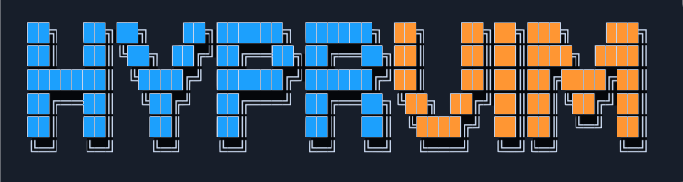

<p align="center">
  
</p>
<hr/>
<p align="center">
  <a href="https://github.com/uhs-robert/hyprvim/stargazers"></a>
  <a href="https://github.com/uhs-robert/hyprvim/issues"></a>
  <a href="https://github.com/uhs-robert/hyprvim/contributors"></a>
  <a href="https://github.com/uhs-robert/hyprvim/network/members"></a>
  <a href="https://github.com/uhs-robert/hyprvim/releases"></a>
</p>

## 🌅 Overview

**HyprVim** brings the power of Vim keybindings and motions to your Hyprland GUI desktop environment.

<https://github.com/user-attachments/assets/1a9c9459-2bfa-4d1d-bf05-24d5174431a9>

<p align=center><i>Think of it as a lightweight, system-wide Vim mode for all of your GUI applications.</i></p>

## ✨ Features

> **📚 Full Reference:** For a complete, searchable reference of all features, visit the [Wiki](https://github.com/uhs-robert/hyprvim/wiki).
>
> **📰 Latest News:** For the latest release information, visit the [News](./NEWS.md).

Built on Hyprland’s native submap system, uses standard GUI application keyboard shortcut macros to emulate Vim-style navigation and text editing.

- **🚦 Vim Modes** - `NORMAL`, `INSERT`, `VISUAL`, `V-LINE`, and `COMMAND` modes
- **🧭 Navigation** - Character (`hjkl`), word (`w/b/e`), line (`0/$`), paragraph (`{}`), page (`Ctrl+d/u`), document (`gg/G`)
- **✂️ Operators** - Delete (`d`), change (`c`), yank (`y`) with motion and text object support
- **📝 Text Objects** - Inner/around word (`iw/aw`), inner/around paragraph (`ip/ap`)
- **🔢 Count Support** - Repeat any motion or operator (e.g., `5j`, `3dw`, `2yy`)
- **📌 Marks** - Save and jump to positions across workspaces/monitors (`m{mark}`, `` `{mark} ``)
- **📋 Registers** - Multi-clipboard with named (`"a-z`) and special registers (`"0`, `"_`, `"/`)
- **🔍 Find/Search** - Interactive search (`/`, `?`, `f`, `t`, `*`, `#`) with next/previous (`n/N`)
- **🔄 Replace** - Character (`r`) and string replacement (`R`)
- **🔁 Surround** - Wrap text with pairs (`gs` for word, `S` in visual) - supports `()`, `{}`, `[]`, `<div>`, or custom with spaces
- **↩️ Undo/Redo** - Standard undo/redo (`u`, `Ctrl+r`)
- **⌨️ Command Mode** - Execute commands (`:w`, `:q`, `:split`, `:float`, `:workspace`, `:reload`, etc.)
- **🗺️ Which-Key HUD** - Shows all keybinds for submaps on entry. Press `SPACE` to toggle (requires `eww`)
- **Open Vim/Nvim Anywhere** - Press `SUPER + N` to open selected text in Vim/Nvim for complex editing. Save/close to paste.

> [!WARNING]
> Just like real Vim, you also need to know how to exit HyprVim: press `SUPER + ESC` or `ALT+ESC`

<details>
<summary><h3>🍭 Extras</h3></summary>
<br>

[All extra configs](extras/) for a better global Vim experience.

To use the extras, refer to their respective documentation.

<!-- extras:start -->

| Tool            | Description                                                               | Extra                                                                |
| --------------- | ------------------------------------------------------------------------- | -------------------------------------------------------------------- |
| Hyprland Basics | Hyprland keymap kickstart config for HyprVim (Resize, Move, Windows, etc) | [extras/hyprland-basics](extras/hyprland-basics)                     |
| Keyd            | System-wide key remaps and tap/hold layers                                | [extras/keyd](extras/keyd)                                           |
| Thunderbird     | Keybinds for Vim driven navigation                                        | [extras/thunderbird](extras/thunderbird)                             |
| Vimium          | Vim-style navigation for web browsers                                     | [extras/vimium](extras/vimium)                                       |
| Waybar Submap   | Waybar submap visual Indicator                                            | [extras/waybar](extras/waybar)                                       |
| WhichKey        | WhichKey like display built using `eww` to see keybinds for submaps       | [wiki/whichkey](https://github.com/uhs-robert/hyprvim/wiki/WhichKey) |
| Wl-kbptr        | Keyboard-driven mouse cursor control on Wayland                           | [extras/wl-kbptr](extras/wl-kbptr)                                   |

If you'd like an extra config added, raise a feature request or put one together and send a pull request.

<!-- extras:end -->
</details>

## 📦 Installation

### Prerequisites

| Name                                           | Description                                                               |
| ---------------------------------------------- | ------------------------------------------------------------------------- |
| [Hyprland](https://github.com/hyprwm/Hyprland) | Wayland compositor                                                        |
| Bash                                           | For shell scripts                                                         |
| `wl-clipboard`                                 | Wayland clipboard utilities (`wl-copy`, `wl-paste`)                       |
| `jq`                                           | JSON processor for parsing hyprctl output                                 |
| A terminal emulator                            | For the `gh` help viewer                                                  |
| A prompt tool                                  | One of: `rofi`, `wofi`, `tofi`, `fuzzel`, `dmenu`, `zenity`, or `kdialog` |
| `eww` _(optional)_                             | Widget system for the which-key HUD                                       |
| `socat` _(optional)_                           | Required by the which-key daemon to listen on Hyprland's event socket     |

### Quick Install

1. Clone this repository into your Hyprland config directory:

```bash
cd ~/.config/hypr
git clone https://github.com/uhs-robert/hyprvim.git
```

2. Add the following line to your `~/.config/hypr/hyprland.conf`:

```bash
source = ~/.config/hypr/hyprvim/init.conf
```

3. Set up any settings in `~/.config/hypr/hyprvim/settings.conf`, see [configuration](#️-configuration)

4. Reload your Hyprland configuration:

```bash
hyprctl reload
```

> [!TIP]
> **Verify installation**: Press `SUPER + ESC` and you should enter NORMAL mode. Press `gh` to view help.

## 🔄 Staying Updated

### Getting the Latest Changes

To update your installation with the latest features and fixes:

```bash
cd ~/.config/hypr/hyprvim
git pull
hyprctl reload
```

### Release Notifications

Stay informed about new releases:

1. **Watch the repository** - Click "Watch" → "Custom" → Check "Releases" on this page
2. **Check the releases page** - View all releases at <https://github.com/uhs-robert/hyprvim/releases>
3. **RSS Feed** - Subscribe to releases: `https://github.com/uhs-robert/hyprvim/releases.atom`

> [!NOTE]
> Each release includes a detailed changelog with new features, improvements, and bug fixes.

## 🚀 Usage

> **📚 Full Reference:** For a complete usage guide, visit the [Wiki](https://github.com/uhs-robert/hyprvim/wiki).

### Quick Start

Press `SUPER + ESCAPE` (or your configured leader key + activation key) to enter NORMAL mode.

#### Basic Workflow

1. **Enter NORMAL mode**: `SUPER + ESC`
2. **See all keybindings**: Press `gh` to show help
3. **Navigate**: Use `hjkl`, `w`, `b`, `e` to move around
4. **Select text/items**: Press `v` for visual mode, then navigate to select
5. **Edit**: Use operators like `d`, `c`, `y` with motions or in visual mode
6. **Return to insert**: Press `i`, `a`, or other insert commands
7. **Exit Vim mode**: Press `SUPER + ESC` again

### Marks

Save and jump to window positions across workspaces and monitors using `m{mark}` to set, `` `{mark} `` to jump.

> **📖 Learn more:** [Marks wiki](https://github.com/uhs-robert/hyprvim/wiki/Advanced#-marks)

### Registers

Multi-clipboard management with named registers (`"a` - `"z`) and special registers (`""` unnamed, `"0` yank, `"_` black hole). Use `"{register}{operation}` (e.g., `"ayy` to yank to register a, `"ap` to paste from register a).

> **📖 Learn more:** [Registers wiki](https://github.com/uhs-robert/hyprvim/wiki/Advanced#-registers)

### Commands

Press `:` in NORMAL mode to execute Vim-style commands. Common commands: `:w` (save), `:q` (quit), `:wq` (save & quit), `:split` (split window), `:float` (toggle floating), `:ws <num>` (switch workspace), `:reload` (reload Hyprland config).

> **📖 Learn more:** [Command Mode wiki](https://github.com/uhs-robert/hyprvim/wiki/Modes#-command-mode)

### Access to Common Keyboard Shortcuts Too

HyprVim includes pragmatic pass-through bindings in NORMAL mode for better GUI interaction: `TAB`, `RETURN`, `CTRL+V/X/A/S/W/Z`.

This enables dialog navigation and clipboard operations without constantly switching to INSERT mode.

> [!WARNING]
> These may trigger unwanted actions in text editors. Use `i` to enter INSERT mode when editing text, or create override bindings by sourcing a custom config after HyprVim.

## ⚙️ Configuration

HyprVim sets a few global defaults in `./init.conf`.

You can override any of these settings by creating your own `./settings.conf` in the `hyprvim` directory:

> [!TIP]
> To override or append keys in each submap, be sure to source your overriding keybindings after HyprVim

1. Copy `settings.conf.example` to `settings.conf`:
2. Edit `./settings.conf` to override any defaults from `./init.conf`

```bash
cd ~/.config/hypr/hyprvim
cp settings.conf.example settings.conf
```

> **📖 Learn more:** [Configuration wiki](https://github.com/uhs-robert/hyprvim/wiki/Configuration)

## 🗑️ Uninstalling

Removing HyprVim from your system is a three step process:

1. Remove the source line from your `~/.config/hypr/hyprland.conf`:

```bash
# Remove this line:
source = ~/.config/hypr/hyprvim/init.conf
```

2. Delete the HyprVim directory:

```bash
rm -rf ~/.config/hypr/hyprvim
```

3. Reload your Hyprland configuration:

```bash
hyprctl reload
```

> [!NOTE]
> Any temporary files created by HyprVim for state management are automatically cleaned up on reboot.

## 🤔 Where is the Visual Mode Indicator and WhichKey?

### Mode Indicator (Waybar)

To see which Vim mode you're currently in, add the [Hyprland submap module](/extras/waybar) to your Waybar configuration.

This displays the active submap in your status bar.

### WhichKey

WhichKey requires `eww` to display. It is an optional feature that is **disabled by default**.

We **highly recommend using WhichKey** to learn the keybindings. It also displays active marks and works with your other submaps too.

You can find the demo and setup instructions [in the Wiki for WhichKey](https://github.com/uhs-robert/hyprvim/wiki/WhichKey).

### More Extras

On that note, check out [all the extras too](/extras)! This is just the tip of the iceberg, you never know what you might find.

## ⚠️ Known Limitations

- No macros
- No visual block mode (`Ctrl+v` or `Ctrl+q`)
- Limited text object support (word and paragraph only)
- Registers/marks are stored in tmpfs (not persistent across reboots)
- Find operations use interactive prompts and application find dialogs
- Effectiveness depends on application supporting standard keyboard shortcuts

> [!WARNING]
> HyprVim is designed for **GUI applications first**. Terminals behave differently.
>
> Terminals often use [a different set of keyboard shortcuts](https://gist.github.com/tuxfight3r/60051ac67c5f0445efee) so motions may not work as expected.
>
> However shells (bash, zsh, etc) usually ship a `vi mode`. Try using that instead.
>
> If you must use it in the shell, some actions _may_ work but your mileage will vary.

## 📏 Extending HyprVim

You can extend HyprVim by adding new submaps or referencing the submaps in your own keybinds after sourcing HyprVim as well as using HyprVim scripts in your own keybinds. Some examples of this are included in the [Hyprland basics](./extras/hyprland-basics).

If you make an enhancement that you think would benefit the community then please submit a pull request and I'll be happy to review it.
