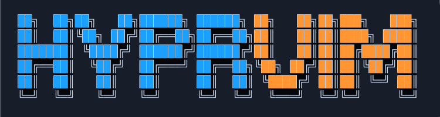

<p align="center">
  
</p>
<hr/>
<p align="center">
  <a href="https://github.com/uhs-robert/hyprvim/stargazers"></a>
  <a href="https://github.com/uhs-robert/hyprvim/issues"></a>
  <a href="https://github.com/uhs-robert/hyprvim/contributors"></a>
  <a href="https://github.com/uhs-robert/hyprvim/network/members"></a>
  <a href="https://github.com/uhs-robert/hyprvim/releases"></a>
  <a href="https://discord.gg/Kr5JrhVR8R"></a>
</p>

## 🌅 Overview

**HyprVim** brings the power of Vim keybindings and motions to your Hyprland desktop environment.

<https://github.com/user-attachments/assets/fe3abc89-bc03-4748-925b-341bbe4686e6>

<p align=center><i>Think of it as a lightweight, system-wide Vim mode for all of your applications.</i></p>

---

> [!IMPORTANT]
> HyprVim now targets Hyprland's Lua plugin/configuration flow.
>
> If you still need the old Hyprland `.conf` format, use the [`legacy-conf`](https://github.com/uhs-robert/hyprvim/tree/legacy-conf) branch. New features and fixes target the Lua version.

## ✨ Features

> **📚 Full Reference:** For a complete, searchable reference of all features, visit the [Guide](./docs/guide/00_README.md).
>
> **📰 Latest News:** For the latest release information, visit the [News](./NEWS.md).

Built on Hyprland’s native submap system, uses standard GUI application keyboard shortcut macros to emulate Vim-style navigation and text editing.

- **🚦 Vim Modes** - `NORMAL`, `INSERT`, `VISUAL`, `V-LINE`, and `COMMAND` modes
- **🧭 Navigation** - Character (`hjkl`), word (`w/b/e`), line (`0/$`), paragraph (`{}`), page (`Ctrl+d/u`), document (`gg/G`)
- **✂️ Operators** - Delete (`d`), change (`c`), yank (`y`) with motion and text object support
- **📝 Text Objects** - Inner/around word (`iw/aw`), inner/around paragraph (`ip/ap`)
- **🔢 Count Support** - Repeat any motion or operator (e.g., `5j`, `3dw`, `2yy`)
- **📌 Marks** - Save and jump to positions across workspaces/monitors (`m{mark}`, `` `{mark} ``)
- **📋 Registers** - Multi-clipboard with named (`"a-z`) and special registers (`"0`, `"_`, `"/`)
- **🔍 Find/Search** - Interactive search (`/`, `?`, `f`, `t`, `*`, `#`) with next/previous (`n/N`)
- **🔄 Replace** - Character (`r`) and string replacement (`R`)
- **🔁 Surround** - Wrap text with pairs (`gs` for word, `S` in visual) - supports `()`, `{}`, `[]`, `<div>`, or custom with spaces
- **↩️ Undo/Redo** - Standard undo/redo (`u`, `Ctrl+r`)
- **⌨️ Command Mode** - Execute commands (`:w`, `:q`, `:split`, `:float`, `:workspace`, `:reload`, etc.)
- **🗺️ Which-Key HUD** - Shows all keybinds for submaps on entry. Press `SPACE` to toggle (requires `eww`)
- **Open Vim/Nvim Anywhere** - Press `SUPER + N` to open selected text in Vim/Nvim for complex editing. Save/close to paste.

> [!WARNING]
> Just like real Vim, you also need to know how to exit HyprVim: press `SUPER + ESC` or `SUPER + V` again

<details>
<summary><h3>🍭 Extras</h3></summary>
<br>

[All extra configs](extras/) for a better global Vim experience.

To use the extras, refer to their respective documentation.

<!-- extras:start -->

| Tool            | Description                                                               | Extra                                              |
| --------------- | ------------------------------------------------------------------------- | -------------------------------------------------- |
| Hyprland Basics | Hyprland keymap kickstart config for HyprVim (Resize, Move, Windows, etc) | [extras/hyprland-basics](extras/hyprland-basics)   |
| Keyd            | System-wide key remaps and tap/hold layers                                | [extras/keyd](extras/keyd)                         |
| Thunderbird     | Keybinds for Vim driven navigation                                        | [extras/thunderbird](extras/thunderbird)           |
| Tridactyl       | Vim-style navigation for Firefox (advanced)                               | [extras/tridactyl](extras/tridactyl)               |
| Vimium          | Vim-style navigation for web browsers (basic)                             | [extras/vimium](extras/vimium)                     |
| Waybar Submap   | Waybar submap visual Indicator                                            | [extras/waybar](extras/waybar)                     |
| WhichKey        | WhichKey like display built using `eww` to see keybinds for submaps       | [docs/guide/whichkey](./docs/guide/05_WhichKey.md) |
| Wl-kbptr        | Keyboard-driven mouse cursor control on Wayland                           | [extras/wl-kbptr](extras/wl-kbptr)                 |

If you'd like an extra config added, raise a feature request or put one together and send a pull request.

<!-- extras:end -->
</details>

## 📦 Installation

### Prerequisites

| Name                                           | Description                                                     |
| ---------------------------------------------- | --------------------------------------------------------------- |
| [Hyprland](https://github.com/hyprwm/Hyprland) | Wayland compositor                                              |
| `wl-clipboard`                                 | Wayland clipboard utilities (`wl-copy`, `wl-paste`)             |
| A terminal emulator                            | For the `command-mode`, `replace-mode`, `find-mode`, and `help` |
| `eww` _(optional)_                             | Widget system for the which-key HUD                             |
| `jq` _(optional)_                              | Required by the which-key HUD and manual-install updater        |
| `socat` _(optional)_                           | Required by the which-key HUD daemon                            |

### AUR Install (Coming Soon)

> [!WARNING]
> HyprVim is currently installed manually.
>
> AUR package is planned. Arch users who prefer package-manager ownership should wait.
>
> Due to the ongoing malware issue on the AUR, this is delayed till the AUR allows registrations once again.

Once the package is published, install `hyprvim` from the AUR with your preferred helper:

```bash
paru -S hyprvim
# or
yay -S hyprvim
```

Create a shim in your Hyprland lua plugins directory:

```bash
mkdir -p ~/.config/hypr/lua/plugins/hyprvim

cat > ~/.config/hypr/lua/plugins/hyprvim/init.lua <<'EOF'
-- Hyprvim bootstrap
local chunk, err = loadfile('/usr/share/hyprvim/init.lua')

if not chunk then
  error(err)
end

return chunk()
EOF
```

Then continue with [Load HyprVim](#load-hyprvim).

### Nix / Home Manager

HyprVim provides a Nix flake and Home Manager module.

Add HyprVim to your flake inputs:

```nix
inputs.hyprvim = {
  url = "github:uhs-robert/hyprvim";
  inputs.nixpkgs.follows = "nixpkgs";
};
```

Then import the Home Manager module:

```nix
{ inputs, ... }:

{
  imports = [
    inputs.hyprvim.homeManagerModules.default
  ];

  programs.hyprvim = {
    enable = true;

    # Optional: installs dependencies for the WhichKey HUD
    whichKey.enable = true;
  };
}
```

The module installs HyprVim to:

```text
~/.config/hypr/lua/plugins/hyprvim
```

so it can be loaded normally from `hyprland.lua`:

```lua
require("lua/plugins/hyprvim").setup({
    -- your HyprVim configuration
})
```

When `whichKey.enable = true`, the module also installs the dependencies required by the WhichKey HUD.

### Manual Install

Manual git-checkout installs also need `git`, `curl`, and `jq` for the built-in updater. Update notifications use `notify-send` when available and fall back to a passive Hyprland notification.

Install HyprVim to `~/.local/share` and create a shim in your Hyprland lua plugins directory:

```bash
git clone https://github.com/uhs-robert/hyprvim \
  ~/.local/share/hyprland/lua/plugins/hyprvim

mkdir -p ~/.config/hypr/lua/plugins/hyprvim

cat > ~/.config/hypr/lua/plugins/hyprvim/init.lua <<'EOF'
-- Hyprvim bootstrap
local path = os.getenv('HOME')
  .. '/.local/share/hyprland/lua/plugins/hyprvim/init.lua'

local chunk, err = loadfile(path)

if not chunk then
  error(err)
end

return chunk()
EOF
```

### Load HyprVim

Add HyprVim to your `~/.config/hypr/hyprland.lua`:

```lua
require("lua/plugins/hyprvim").setup()
```

> [!TIP]
> You may also pass a table of [configuration settings](#️-configuration) to customize your experience.

Save and reload your Hyprland config:

```bash
hyprctl reload
```

> [!TIP]
> **Verify installation**: Press `SUPER + V` and you should enter **NORMAL** mode.

If `SUPER + V` does nothing after install, it is taken by something else in your config. Set `activate` to any free key:

```lua
require("hyprvim").setup({ keys = { activate = "ESCAPE" } })
```

## 🔄 Staying Updated

Package-managed installs handle updates through pacman or your AUR helper. Update HyprVim as you would any package in your package manager.

For git-checkout installs, HyprVim checks for updates on every Hyprland reload and notifies you via your desktop notification daemon. Clicking the notification applies the update and reloads automatically.

Manual git-checkout users can also run `:update` at any time from NORMAL mode to apply manually. Package-managed installs should use pacman or an AUR helper instead.

The default channel is `"stable"` (latest GitHub release). Configure it in your `setup()` call:

```lua
updates = {
  channel = "stable",   -- latest release (default)
  -- channel = "nightly",  -- git HEAD
  -- channel = "v1.2.3",   -- pinned release tag
  -- channel = "abc1234",  -- pinned commit SHA
  -- channel = "off",      -- disable update checks
},
```

> [!NOTE]
> Update notifications require `notify-send` (libnotify) and a compatible notification daemon (dunst, mako, or swaync).
>
> Without one of those, manual git-checkout installs show a passive Hyprland notification instead and you must use `:update` to apply.

## 🚀 Usage

> **📚 Full Reference:** For a complete usage guide, visit the [Guide](./docs/guide/00_README.md).

### Quick Start

Press `SUPER + V` (or your configured leader key + activation key) to enter **NORMAL** mode.

#### Basic Workflow

1. **Enter NORMAL mode**: `SUPER + V`
2. **See all keybindings**: Press `gh` to show help
3. **Navigate**: Use `hjkl`, `w`, `b`, `e` to move around
4. **Select text/items**: Press `v` for visual mode, then navigate to select
5. **Edit**: Use operators like `d`, `c`, `y` with motions or in visual mode
6. **Return to insert**: Press `i`, `a`, or other insert commands
7. **Exit Vim mode**: Press `SUPER + V` again or `SUPER + ESC`

### Marks

Save and jump to window positions across workspaces and monitors using `m{mark}` to set, `` `{mark} `` to jump.

> **📖 Learn more:** [Marks guide](./docs/guide/04_Advanced.md#-marks)

### Registers

Multi-clipboard management with named registers (`"a` - `"z`) and special registers (`""` unnamed, `"0` yank, `"_` black hole). Use `"{register}{operation}` (e.g., `"ayy` to yank to register a, `"ap` to paste from register a).

> **📖 Learn more:** [Registers guide](./docs/guide/04_Advanced.md#-registers)

### Commands

Press `:` in **NORMAL** mode to execute Vim-style commands. Common commands: `:w` (save), `:q` (quit), `:wq` (save & quit), `:split` (split window), `:float [on|off]` (floating), `:fullscreen [maximized|fullscreen]`, `:workspace <N|name:Web|empty>` (switch workspace), `:move_workspace N` (send window to workspace), `:move X Y` (nudge by pixels), `:monitor <dir|name>` (focus monitor), `:window class:firefox` (focus window), `:rename <name>` (rename workspace), `:special <name>` (scratchpad), `:swap <l|r|u|d>`, `:resize_width N`, `:opacity V`, `:prop <name> <value>`, `:reload`, `:update`, `:!cmd` (shell). Full reference: `:help`.

> **📖 Learn more:** [Command Mode guide](./docs/guide/03_Modes.md#-command-mode)

### Access to Common Keyboard Shortcuts Too

HyprVim includes pragmatic pass-through bindings in **NORMAL** mode for better GUI interaction: `TAB`, `RETURN`, `CTRL+V/X/A/S/W/Z`.

This enables dialog navigation and clipboard operations without constantly switching to INSERT mode.

> [!WARNING]
> These may trigger unwanted actions in text editors. Use `i` to enter INSERT mode when editing text, or override bindings via the [`keymaps` option](#️-configuration).

## ⚙️ Configuration

HyprVim offers _many_ different options to choose from. Have fun customizing with `setup()`!

<details>
  <summary>🍦 Default Options</summary>
  <br>
<!-- config:start -->

```lua
require("hyprvim").setup({
  keys = {
    leader = "SUPER",
    activate = "V",
    exit = "ESCAPE",
  },
  applications = {
    terminal = "kitty",
    term_flags = nil,                             -- add entries here for custom terminal launch flags
    lock = "hyprlock",
    editor = "nvim",                              -- `vim` or `nvim`
  },
  notifications = {
    all = false,                -- Enable to bypass settings below and just enable all
    marks = false,
    warnings = true,
    errors = true,
  },
  prompt = {
    completion_menu = true,     -- Tab opens an fzf menu in the command bar; false cycles matches instead
    completion_height = 400,    -- Pixel height the bar grows to while the menu is open
  },
  updates = {
    channel = "stable",         -- "stable" (latest release), "nightly" (git HEAD), "off", or a tag/commit SHA to pin
  },
  enable_debug = false,
  max_count = 1000,
  which_key = {
    enabled = true,             -- This requires eww
    delay_ms = 0,               -- 0 = instant, else delayed a bit (200 gives you some breathing room)
    vim_delay_ms = 300,
    position = "bottom-right",
    auto_show = {
      disabled = {
        "NORMAL",
        "VISUAL",
        "V-LINE",
        "INSERT",
      },
      enabled = nil, -- nil enables all except those in disabled. You could make disabled = nil and then it would work the opposite.
    },
  },
  -- keymaps = {
  --   NORMAL = {
  --     { "w", function() my_fn() end, { desc = "My word" } }, -- override a built-in bind
  --     { "SUPER + x", function() end },                       -- add a new bind
  --   },
  -- },
  -- commands = {
  --   browser = function() hl.dispatch(hl.dsp.exec_cmd("firefox")) end, -- add a new :command
  --   q       = function() my_custom_quit() end,                        -- override a built-in
  -- },
})
```

<!-- config:end -->
</details>

> **📖 Learn more:** [Configuration guide](./docs/guide/01_Configuration.md)

## 🗑️ Uninstalling

For AUR installs, remove the package and the Hyprland plugin shim:

```bash
paru -R hyprvim
# or
yay -R hyprvim

rm -rf ~/.config/hypr/lua/plugins/hyprvim
hyprctl reload
```

For manual git-checkout installs, remove the shim and cloned plugin directory:

```bash
rm -rf ~/.config/hypr/lua/plugins/hyprvim
rm -rf ~/.local/share/hyprland/lua/plugins/hyprvim
hyprctl reload
```

> [!NOTE]
> Any temporary files created by HyprVim for state management are automatically cleaned up on reboot.

## 🤔 Where is the Visual Mode Indicator and WhichKey?

### Mode Indicator (Waybar)

To see which Vim mode you're currently in, add the [Hyprland submap module](/extras/waybar) to your Waybar configuration.

This displays the active submap in your status bar.

### WhichKey

WhichKey requires `eww` to display. It is an optional feature that is **disabled by default**.

We **highly recommend using WhichKey** to learn the keybindings. It also displays active marks and works with your other submaps too.

You can find the demo and setup instructions [in the Guide for WhichKey](./docs/guide/05_WhichKey.md).

### More Extras

On that note, check out [all the extras too](/extras)! This is just the tip of the iceberg, you never know what you might find.

## ⚠️ Known Limitations

- No macros
- No visual block mode (`Ctrl+v` or `Ctrl+q`)
- Limited text object support (word and paragraph only)
- Registers/marks are stored in tmpfs (not persistent across reboots)
- Find operations use interactive prompts and application find dialogs
- Effectiveness depends on application supporting standard keyboard shortcuts

> [!WARNING]
> HyprVim is designed for **GUI applications first**. Terminals behave differently.
>
> Terminals often use [a different set of keyboard shortcuts](https://gist.github.com/tuxfight3r/60051ac67c5f0445efee) so motions may not work as expected.
>
> However shells (bash, zsh, etc) usually ship a `vi mode`. Try using that instead.
>
> If you must use it in the shell, some actions _may_ work but your mileage will vary.

## 📏 Extending HyprVim

### Overriding or Adding Keybinds

Pass a `keymaps` table to `setup()` to override or extend the binds in any built-in submap.

Entries where a key matches a built-in bind will replace them; new keys are appended.

```lua
require("hyprvim").setup({
  keymaps = {
    NORMAL = {
      { "w", function() my_custom_word() end, { desc = "custom word" } },  -- override built-in w
      { "SUPER + X", function() my_extra_action() end },                   -- add a new bind
      { "SUPER + M", hl.dsp.submap("my-submap"), { desc = "my submap" } }, -- or add a submap dispatch shortcut to one of your own
    },
    VISUAL = {
      { "y", function() my_custom_yank() end, { desc = "custom yank" } },
    },
  },
})
```

Because `keymaps` are evaluated at `setup()` call time, inside your `hyprland.lua`, any functions that you have defined there are in scope.

Built-in submap names: `"NORMAL"`, `"VISUAL"`, `"V-LINE"`, `"INSERT"`, `"G-MOTION"`, `"G-VISUAL"`.

### Adding Custom Commands

Pass a `commands` table to `setup()` to add new `:commands` or override built-ins.

```lua
require("hyprvim").setup({
  commands = {
    browser  = function() hl.dispatch(hl.dsp.exec_cmd("firefox")) end,
    files    = function() hl.dispatch(hl.dsp.exec_cmd("thunar")) end,
    myaction = function() hl.exec_cmd("my-script") end,
  },
})
```

Custom commands appear in tab-completion alongside the built-in ones. Give one a description and arguments with the table form:

```lua
require("hyprvim").setup({
  commands = {
    scratch = {
      function(args) hl.dispatch(hl.dsp.exec_cmd("my-scratch " .. args)) end,
      desc = "open a scratch buffer",
      args = { { hint = "buffer name", values = { { "notes", "daily notes" } } } },
    },
  },
})
``` Install [fzf](https://github.com/junegunn/fzf) to get a searchable completion menu in the command bar instead of plain cycling.

### Other Extensions

You can also reference HyprVim submaps in your own keybinds after sourcing HyprVim and use HyprVim scripts in your own keybinds. Some examples are included in [Hyprland basics](./extras/hyprland-basics).

If you make an enhancement that you think would benefit the community then please submit a pull request and I'll be happy to review it.

## 💬 Community

Questions, ideas, or want to show off your config? Join the [HyprVim Discord](https://discord.gg/Kr5JrhVR8R).

Bug reports and feature requests still belong in [GitHub issues](https://github.com/uhs-robert/hyprvim/issues) so they don't get lost in chat.
